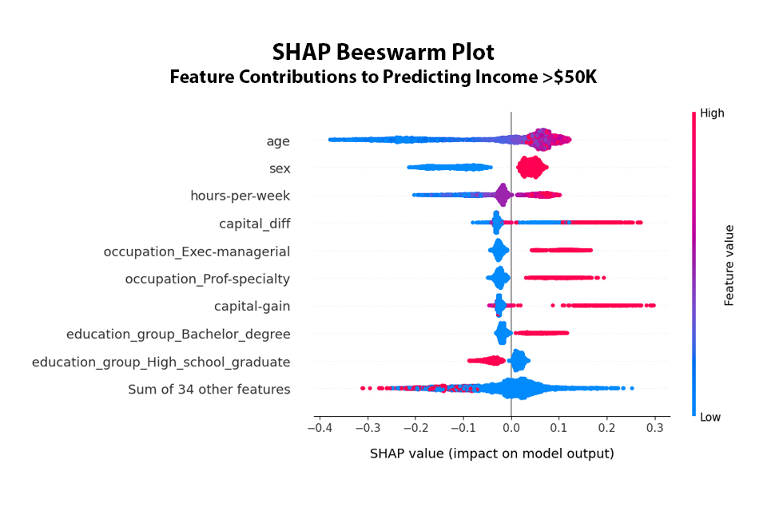
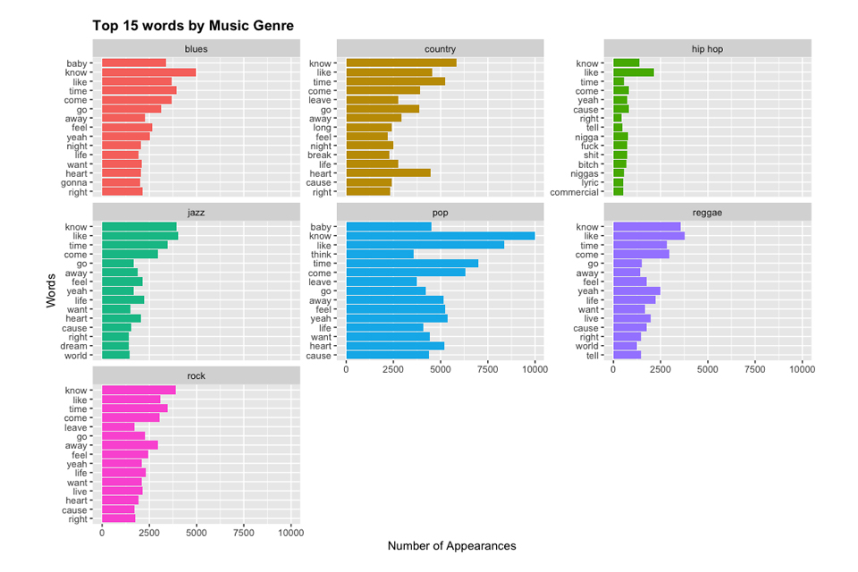
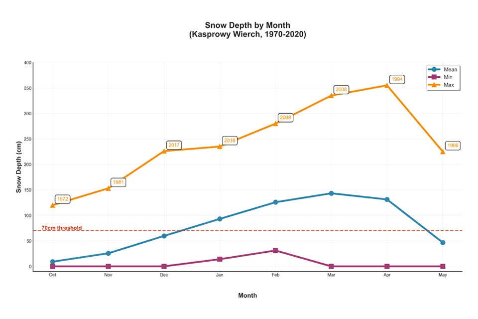
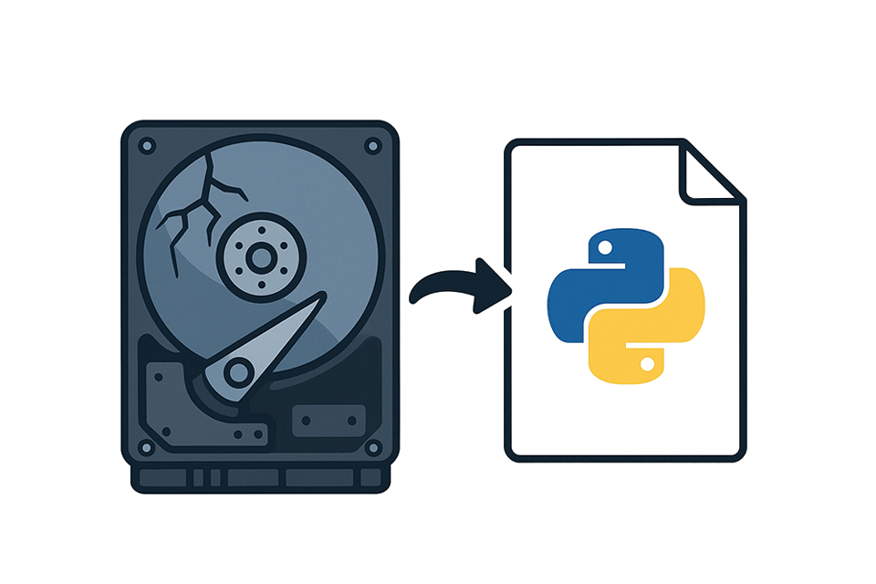
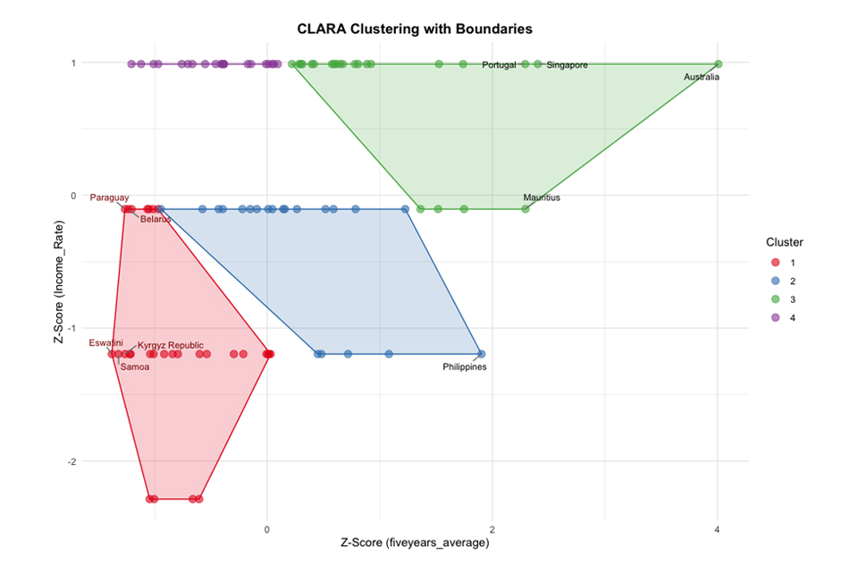
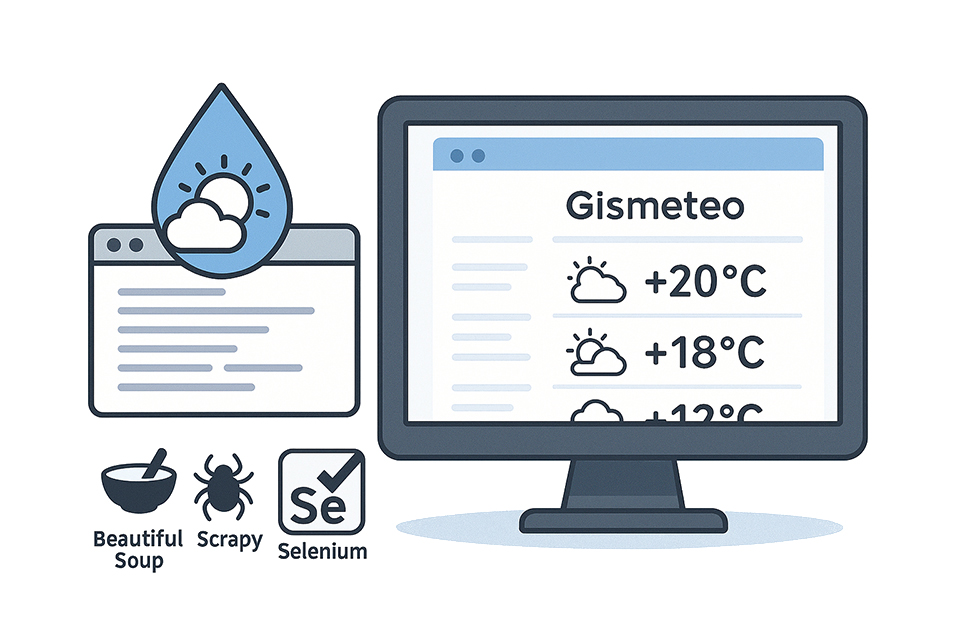

# 👋 About Me:
Hi, my name is Alex.  At the moment, I work as a Data Analyst and am developing my skills to become a professional Data Scientist.  Also, I have completed Master’s program in Data Science and Business Analytics at Warsaw University and am now focused solely on finalizing and defending my Master Thesis, where I explore the intricate world of audio analysis, focusing on the segmentation and classification of sound.  Always brimming with enthusiasm to connect with others, and I eagerly seek to collaborate on captivating projects within the realms of data analysis, machine learning, deep learning, and artificial intelligence.  Alongside this, I am diligently expanding my expertise, embarking on a learning adventure with TensorFlow and PyTorch, tools that promise to unlock new dimensions in my research and beyond.

Feel free to connect with me on  — I’ll be glad to connect!
  

# 💻 Tech Stack:
                                   
  

# 📈 Projects:

<table>
  <tr>
  <td align="center" valign="top" width="33%">
      <a href="https://github.com/alxdmchk/salary-prediction">
        
        <h3>Salary Prediction</h3>
      </a>
      
Machine learning models for predicting salary with explainability

      

        
        
        
        
        
        
        
        
        
      

    </td>
    <td align="center" valign="top" width="33%">
      <a href="https://github.com/alxdmchk/music-lyrics-analysis">
        
        <h3>Music Lyrics Analysis</h3>
      </a>
      
Topic modeling, clustering and sentiment analysis of song lyrics from 1950 to 2019

      

        
        
        
        
        
      

    </td>
    <td align="center" valign="top" width="33%">
      <a href="https://github.com/alxdmchk/ski-season-analysis">
        
        <h3>Ski Season Analysis</h3>
      </a>
      
Exploratory analysis of ski season in Low Tatras from 1970 to 2020

      

        
        
        
        
        
        
      

    </td>
  </tr>
  <tr>
      <td align="center" valign="top" width="33%">
      <a href="https://github.com/alxdmchk/brocopy">
        
        <h3>Brocopy</h3>
      </a>
      
Python tool to copy files from damaged drives, with flexible user-defined settings

      

        
      

    </td>
    <td align="center" valign="top" width="33%">
      <a href="https://github.com/alxdmchk/global-tourism-expenditures">
        
        <h3>Global Tourism Expenditures</h3>
      </a>
      
Unsupervised clustering of global tourism expenditures for international travel

      

        
        
        
        
        
      

    </td>
    <td align="center" valign="top" width="33%">
      <a href="https://github.com/alxdmchk/gismeteo-parser">
        
        <h3>Gismeteo Parser</h3>
      </a>
      
Scraping and structuring weather data with BeautifulSoup, Scrapy and Selenium.

      

        
        
        
        
      

    </td>
  </tr>
</table>